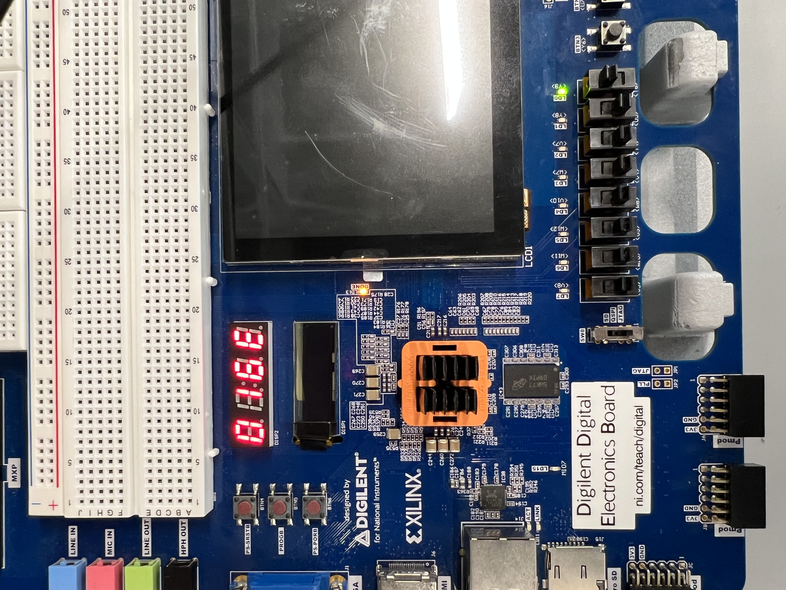

# Cracking a 64-bit DES using an FPGA

We began with some aspects of the project already completed, although many of these sections were relatively easy, such as our Count and Comparator modules.  The only truly difficult module would have been the DES module itself, which was provided to us presumably just in case we didn't complete the lab that required us to make it properly.

In short, we only had to make minor edits to some of the files, and completely write the control logic and the top module, which regulated the entire system.

## Creating the control logic

While the control logic was technically unnecessary to have right away, we started on it first since we found a diagram in a lecture, it is shown here:


With the diagram already provided, it was relatively easy to create the FSM itself.  That is shown below:

```
module control(clk, reset, start, found, up, en1, en2);
input logic clk;
input logic reset;
input logic start;
input logic found;

output logic up;
output logic en1;
output logic en2;

typedef enum logic [1:0] {idle, upcount, store, foundkey} statetype;
statetype state, nextstate;

always_ff @(posedge clk, posedge reset)
    if(reset) state <= idle;
    else state <= nextstate;

always_comb 
    case(state)
        idle: begin
            up <= 1'b0;
            en1 <= 1'b0;
            en2 <= 1'b0;

            if(start) nextstate <= upcount;
            else nextstate <= idle;
        end

        upcount: begin
            up <= 1'b1;
            en1 <= 1'b0;
            en2 <= 1'b0;

            nextstate <= store;
        end

        store: begin
            up <= 1'b0;
            en1 <= 1'b1;
            en2 <= 1'b0;

            if(found) nextstate <= foundkey;
            else nextstate <= upcount;
        end

        foundkey: begin
            up <= 1'b0;
            en1 <= 1'b0;
            en2 <= 1'b1;

            if(!start) nextstate <= idle;
        end

        default: begin
            up <= 1'b0;
            en1 <= 1'b0;
            en2 <= 1'b0;

            nextstate <= idle;
        end
    endcase


endmodule
```

## Creating the top module

With the control logic finished, we moved onto the top module.  Essentially this entailed calling the different functions in a specified order.  We essentially referred to another diagram (albeit a less detailed one than the one for the control logic) as our basis, and moved on from there.  After testing, we managed to create something that worked:

```
module top (input logic clk, Start, reset, input logic [63:0] plaintext, ciphertext, output logic [55:0] count, output logic [63:0] Key, output logic FoundKeyNum);

  logic up;
  logic en1;
  logic en2;
  logic [63:0] info1;
  logic [63:0] info2;
  logic [63:0] info3;

  control ctrl (~clk, reset, Start, FoundKeyNum, up, en1, en2);
  
  UDL_Count #(56) counter (clk, reset, up, 1'b0, 1'b0, 56'h0, count);
  
  genParity8 parity (count, Key);
  
  DES des (Key, plaintext, 1'b1, info1); 
  
  flopenr #(64) cipherRegister (clk, reset, en1, info1, info2);
  
  flopenr #(64) keyRegister (clk, reset, en2, Key, info3); 
  
  comparator #(64) comp (ciphertext, info2, FoundKeyNum);

endmodule

module genParity8(input logic [55:0] in, output logic [63:0] out);         **parity modules were given to us by the professor after the fact, and we added them here**
  genvar 						index;
  for(index = 0; index < 8; index++) begin
	genParity genParity(.in(in[7*index +: 7]), .out(out[8*index +: 8]));
  end
endmodule

module genParity(input logic [6:0] in, output logic [7:0] out);
  assign out[0] = ~^in;
  assign out[7:1] = in;
endmodule
```

## Testing:

We ran into a myriad of issues while testing, most of which were quite difficult to diagnose.  After a successful compilation, our program would often run infinitely.  Another factor that slowed us down was not knowning how long our key would take to generate, and the massive cache files that were generated while running the simulation (which were often 20-30 gigabytes).

The only significant error we had turned out to be our states in the control logic were ordered backwards in the code unintentionally, which created that infinitly running effect.  It was all fixed relatively easily, and after testing the code with a friend's plaintext and ciphertext that we knew would take relatively little time, we knew ours was ready.

##Implementation:
In simulation, our plaintext and ciphertext took around 20 million nanoseconds of simulated time to work, and our final key was 01010101016ee0ba.  It was intentionally designed to be a 6-bit key, to make it easier to find via simulation.  This still took almost an hour of real life time to run, for reference.  Implemented on the dsdb board, our results are shown here:


#### The 6th and 5th bits:




#### The 4th -> 1st bits:


